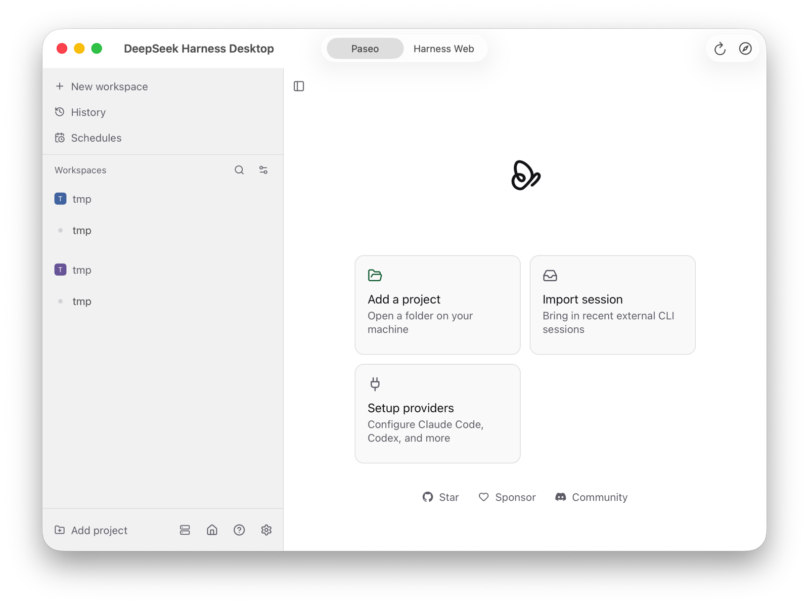
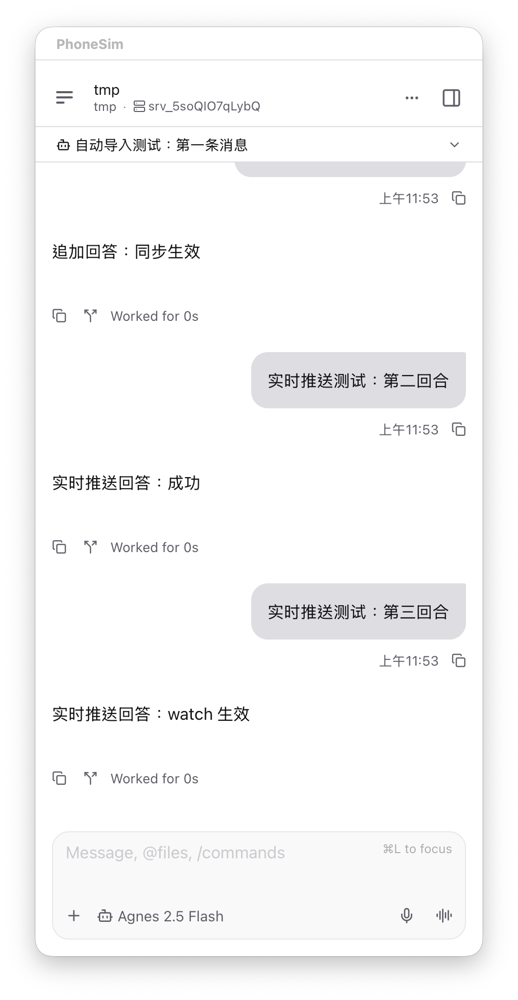
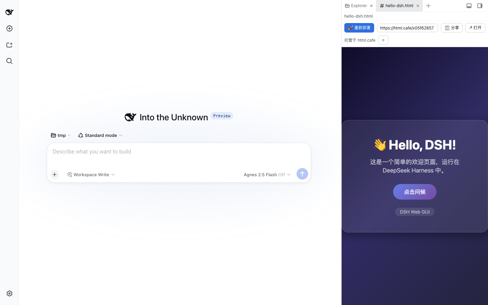
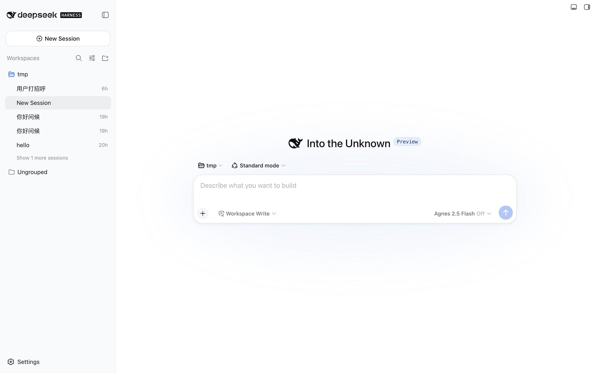

<p align="center">
  
</p>

# DeepSeek Harness Desktop

**[🐋 宣传站](https://dsh-desktop.vercel.app)**（[国内镜像](https://vvlife.github.io/deepseek-harness-desktop/)）·
**[⬇ DMG 下载](https://github.com/vvlife/deepseek-harness-desktop/releases/latest)** ·
[Release Notes](https://github.com/vvlife/deepseek-harness-desktop/releases)

**DeepSeek Harness（dsh）的一站式 macOS 桌面版**：把 Node 运行时、完整的 dsh、完整的
[Paseo](https://github.com/getpaseo/paseo)（daemon + Web UI + 移动端直连）全部打进一个 APP。
拖进「应用程序」双击即用——**不需要预装任何东西**；手机上扫码就能直连你的 agent；
再接上插件市场，HTML 预览、公网发布点一下就完事。

使用私有 `PASEO_HOME` / `DSH_HOME` 与非默认端口，**不读不写、也不干扰**你本机已有的 dsh 和 Paseo。

## 五大特性

### 🚀 一站式安装：拖进「应用程序」，双击，完

Node v22 运行时、完整 dsh、完整 Paseo（daemon + Web UI + 移动端配对）全在包里——
不需要 Homebrew、不需要 npm、不需要任何预装。dsh 经零依赖 ACP 桥自动注册为 Paseo 的
「DeepSeek Harness」provider，打开就在列表里，没有强行引导向导。

<p></p>

### 📱 移动端访问：手机扫码，agent 随身走

内置完整 Paseo 移动端直连：Web 界面一键生成配对二维码，手机 Paseo App 扫码即连
（经官方 relay，端到端加密）。Web 界面里的对话还会**自动镜像**成 Paseo agent——
手机端实时可见（含思考过程），还能在手机上追问续聊。退出 APP 服务默认保持运行，移动端不掉线。

<p></p>

### 🧩 插件市场：66+ 社区插件，点一下就装好

dsh 的信条是「Everything is a Plugin」。接上 [WhaleHub](https://github.com/vvlife/whalehub-dsh)
市场插件后，Web 界面的「设置 → Plugins」会多出「**🐋 插件市场**」Tab：浏览、搜索、
**一键安装**皮肤、TUI、视觉工具、工作流等 66+ 社区插件，不用再翻仓库抄命令
（市场数据每日同步自社区精选列表 [awesome-deepseek-harness-plugins](https://github.com/vvlife/awesome-deepseek-harness-plugins)）：

```sh
dsh plugin --profile web add "github:vvlife/whalehub-dsh#main&path:/plugin"
# 重启 Web 界面 → 设置 → Plugins → 🐋 插件市场
```

<p></p>

### 👁 内置预览：HTML / 文件即点即看

Web 界面自带工作区文件预览，HTML 页面（含游戏、交互页）直接在侧边栏里跑，
改完刷新即看，不用离开对话。

### 🌐 发布公网：一键部署，拿到链接就分享

装上 [dsh-deploy-share](https://github.com/vvlife/dsh-deploy-share) 插件，HTML 预览顶部多出
「🚀 部署 / 📋 分享」按钮：把 agent 写的页面一键部署到**免账号**匿名托管，
拿到公开链接发给任何人；部署后自动回读校验，真渲染成功才算数：

```sh
dsh plugin --profile web add github:vvlife/dsh-deploy-share
```

<p></p>

> A self-contained macOS app bundling a universal Node runtime + full Paseo
> (daemon, Web UI, mobile pairing) + full DeepSeek Harness as a Paseo provider
> (via a zero-dependency ACP bridge). Drag to Applications and go — one-stop install,
> mobile access, a plugin marketplace, built-in preview and one-click public deploy
> (via plugins), fully isolated from any dsh/Paseo you already have installed.

## 安装（DMG，推荐）

1. 下载 [DeepSeek-Harness-Desktop-0.3.7.dmg](https://github.com/vvlife/deepseek-harness-desktop/releases/latest/download/DeepSeek-Harness-Desktop-0.3.7.dmg)（约 350MB，universal）
2. 打开 DMG，把 **DeepSeek Harness Desktop** 拖进 **Applications**
3. 双击打开。未做 Apple 公证：macOS 15 首次打开需右键 → 打开，
   或「系统设置 → 隐私与安全性 → 仍要打开」

打开后 APP 会启动内置 Paseo daemon（127.0.0.1 独立端口）并在窗口里显示 Paseo Web UI，
「DeepSeek Harness」provider 已自动注册好。新建 agent 时选择它即可。
工具栏可在「**Mobile / Web**」两个界面间切换（Mobile = Paseo agent 界面，与手机同步；
Web = dsh 自带的 Web 界面，同一私有 `DSH_HOME`；两个视图常驻内存，切换不重载）。
要真正对话时：切到 **Web** 界面 → 其内置设置的「模型」页粘贴 DeepSeek 官方或 Agnes 的 API Key，保存即可。

<p></p>

### 移动端直连（手机遥控 agent）

切到 **Web** 界面 → 右上角**手机图标** →「**生成配对二维码**」→ 用手机 Paseo App
扫码（或打开配对链接）即可连到本 APP 的内置服务（经 Paseo 官方 relay，端到端加密）。
Paseo 界面里的 agent 对话在手机与电脑之间**实时同步**；退出 APP 后内置服务**默认保持运行**，
移动端可继续连接。若手机提示超时，点「刷新配对码」后立刻重扫（relay 重连窗口期会导致偶发超时）。

> **Web 界面的对话也能上手机**：APP 每 20s 把 Web 界面（dsh web）里的新会话
> 自动镜像为 Paseo agent（标题同名，含完整对话与思考过程），手机端直接可见；
> 在手机上追问也能接续原对话（带上下文注入，回合写入 overlay 持久化）。
> 镜像通过 ACP `session/list` + `session/load` 回放实现，dsh web 本体零改动。

### 备选：curl|bash 命令行安装器

适合把 dsh 装进系统（全局 npm）并接通**你已有的** Paseo 的场景，无 Gatekeeper 提示：

```sh
curl -fsSL https://raw.githubusercontent.com/vvlife/deepseek-harness-desktop/main/install.sh | bash
```

详见[常用参数](#常用参数)。DMG 与 curl 两条路线互不影响。

## APP 做了什么

- 以私有 `PASEO_HOME`（`~/Library/Application Support/DeepSeek Harness Desktop/paseo-home`）
  启动内置 Paseo daemon，监听 `127.0.0.1` 的独立端口（默认 6868 起自动挑选，避开本机 Paseo 的 6767）
- Web UI 由 daemon 直接服务（`PASEO_WEB_UI_ENABLED` 等效配置已持久化到私有 config.json）
- 私有 `DSH_HOME` 下的 ACP 桥 + wrapper 把 dsh 注册为 Paseo provider「DeepSeek Harness」，
  桥与 dsh 全部走 APP 内置 Node 运行时
- 双界面切换：Mobile（Paseo Web UI）与 Web（dsh web，独立端口 3180 起自动挑选）；
  两视图常驻内存、切换不重载；界面切换不影响 daemon，移动端连接与会话状态保持同步
- LLM 提供商/API Key 在 Web 界面的内置「模型」设置里配置（dsh 原生 UI）；
  移动端配对二维码在 Web 界面右上角手机图标里
- 全部数据都在自己的 Application Support 目录，**不碰** `~/.dsh` / `~/.paseo`

## 关于"DeepSeek 登录"

DeepSeek 的 API **没有账号 OAuth 登录**。设置页里的「获取 Key」= 帮你打开
[platform.deepseek.com](https://platform.deepseek.com/api_keys)（在那里登录 DeepSeek 账号、
创建 API Key），回到 APP 粘贴即可。key 写入 APP 私有的 `.credentials.yaml`（权限 0600）。

## 卸载

```sh
# 1. 停掉内置服务（若在运行）
"/Applications/DeepSeek Harness Desktop.app/Contents/Resources/runtime/node/bin/paseo" daemon stop
# 2. APP 拖进废纸篓，删除数据目录
rm -rf ~/Library/Application\ Support/DeepSeek\ Harness\ Desktop
```

不碰系统里任何其他东西（内置服务使用私有 home，无注册表项残留）。

## 常用参数（curl|bash 安装器）

```sh
# 非交互：直接指定 provider 与 key
curl -fsSL .../install.sh | bash -s -- --yes --provider deepseek --key sk-...

# 用 Agnes / 自定义 OpenAI 兼容端点
... bash -s -- --yes --provider agnes --key sk-...
... bash -s -- --yes --provider custom --base-url https://api.example.com/v1 --model my-model --key sk-...

# 跳过凭据（稍后在 dsh web 的模型设置页填）
... bash -s -- --yes --skip-auth

# 本机已装好 dsh / 不想动 Paseo
... bash -s -- --skip-dsh --skip-paseo
```

| flag | 作用 |
|---|---|
| `--provider deepseek\|agnes\|custom` | 选择 LLM 提供商（默认交互询问，deepseek 为推荐项） |
| `--key` | API Key（不给则查环境变量/凭据层，交互模式会提示粘贴） |
| `--base-url --model --provider-id --env-name --display-name` | custom provider 的细节 |
| `--yes` | 非交互模式（全默认） |
| `--skip-auth` | 跳过凭据配置 |
| `--skip-dsh` / `--skip-paseo` | 跳过对应组件安装 |
| `--restart-daemon` | 装完立即重启 Paseo daemon（默认不打扰正在运行的 daemon） |
| `--uninstall` | 卸载安装器写入的内容（桥/provider 注册/路由 patch） |

## 自检

curl|bash 安装末尾自动跑 `scripts/smoke-test.mjs`（ACP 协议握手 + 配置断言，不发起真实 LLM 调用）。
手动重跑：

```sh
node scripts/smoke-test.mjs                # 基础自检
node scripts/smoke-test.mjs --e2e          # 追加一次真实 dsh 调用（消耗少量 API 额度）
```

DMG 构建时会做更完整的自测：包内运行时真启动一次 dsh web 断言 200；
再以临时私有 home 启动 Paseo daemon → 断言 Web UI 200 → 注册 provider →
断言 `provider ls` 出现「DeepSeek Harness」→ 停 daemon。全绿才出包。

## FAQ

**DMG 为什么有 350MB？** 因为把 Node 运行时、完整 dsh 和完整 Paseo（含双架构原生模块）
都打进了包里，换来「零前置依赖、不与本机环境互相干扰」。

**Paseo 不是 Electron 应用吗，怎么内置的？** Paseo 的 daemon / CLI / 服务端是纯 Node 程序
（桌面版只是借用 Electron 二进制当 Node 运行时）。我们从官方 DMG 原样解包这部分，
用内置 Node 运行，不经任何修改；Web UI 静态资源同样来自官方 DMG。

**会动我本地的 dsh / Paseo 吗？** 不会。私有 home + 独立端口，和你已有的实例完全平行；
你的 Paseo（若有）照常使用 `~/.paseo` 与 6767 端口。

**插件市场 / 公网发布是 APP 内置的吗？** 插件体系是 dsh 原生的，APP 里的 Web 界面完整支持；
「插件市场 Tab」和「部署分享按钮」分别由 WhaleHub 市场插件与 dsh-deploy-share 插件提供，
都是一条 `dsh plugin add` 命令装好（命令见上文对应小节）。

**Paseo 里的对话为什么没有上下文？** 每个 prompt 回合是一次独立的 `dsh --profile headless`
运行（dsh headless 无 resume），回合间不保留对话上下文。

**设置里的 Providers 页显示 "Connect to this host to see providers"？** 这是 v0.3.0 的已知问题：
数据目录重建后 daemon 身份（serverId）变化，Web UI 的 host 注册表拒绝接受新身份。v0.3.1 起
APP 固定 serverId 并在身份变化时自动重置 Web UI 本地数据；旧版本手动修复 = 退出 APP，
删除 `~/Library/WebKit/com.vvlife.dsh-desktop` 后重开。

**和 dsh-agnes-paseo 什么关系？** 本仓库是其演进形态：provider 从写死 Agnes 变为可选，
并升级为自包含桌面 APP。旧插件不受影响。

**本地构建 DMG？** `app/make-app.sh`（swiftc 直编 SwiftUI + Node 官方 dist lipo 合并 +
npm 双架构 dsh 依赖树合并 + Paseo 官方 DMG 解包双架构合并 + 签名 + 全链路自测 + hdiutil）。
签名优先使用钥匙串中的自签证书「DSH Desktop Local Code Signing」（身份稳定，macOS 的
目录访问授权按证书锚定、跨启动与重新构建持久）；没有该证书时回退 ad-hoc（授权记录无法
匹配，每次启动都会重新弹「访问文稿文件夹」授权框）。

## 许可

本仓库代码 MIT（`LICENSE`）。APP 内置的 Node.js（MIT，`LICENSE-node`）、
`@deepseek-ai/dsh`（MIT）与 Paseo 服务端组件（**AGPL-3.0**，未经修改、附源码链接）
均为上游发布物原样打包。详见 `THIRD-PARTY-LICENSES.md`。
